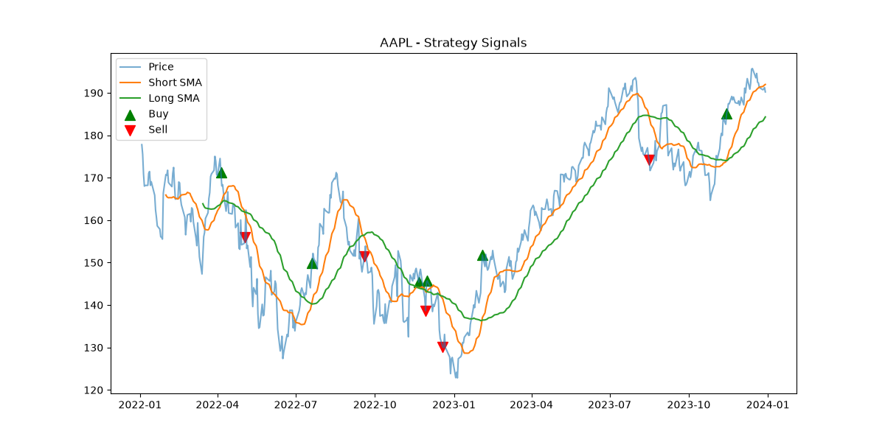
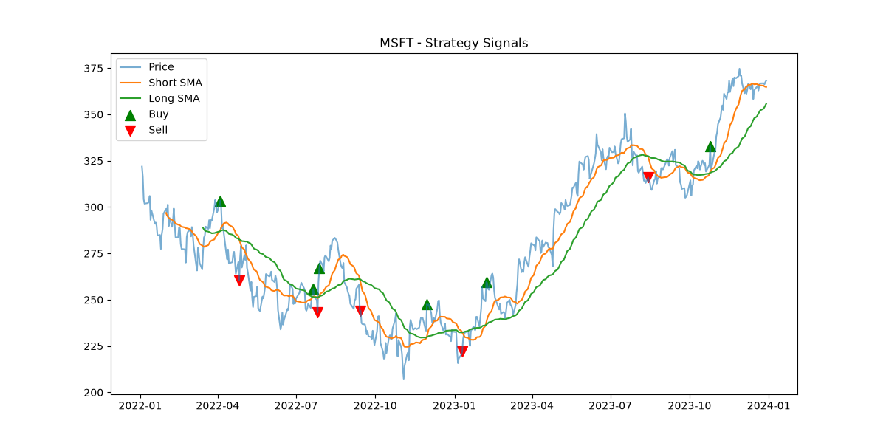
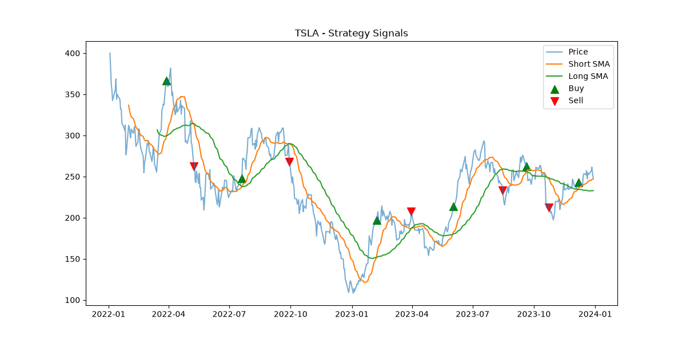
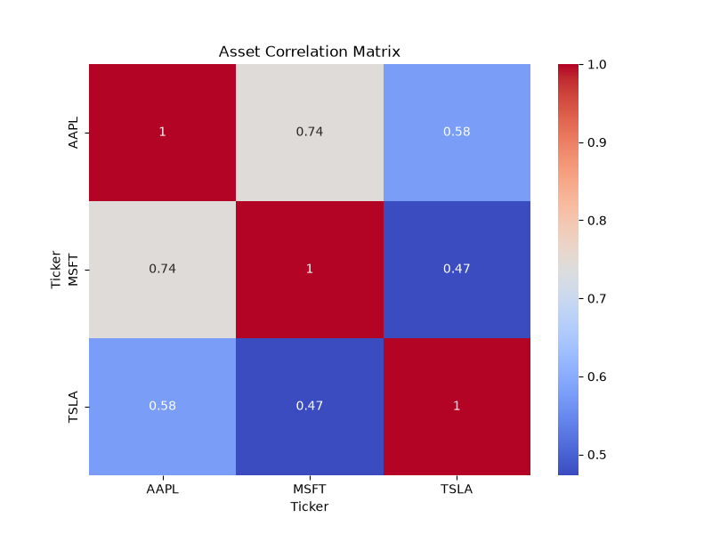

# Stock Portfolio Risk Analyzer

A Python project that downloads real stock market data, measures how risky each stock is, tests a simple trading rule, trains a machine learning model to guess the next day's direction, and presents everything in charts and a written findings report.

**Stocks analysed:** Apple (AAPL), Microsoft (MSFT), Tesla (TSLA)
**Period:** 3 January 2022 to 29 December 2023 (501 trading days)
**Data source:** Yahoo Finance via the free `yfinance` library (no API key needed)

---

## Table of contents

1. [Business problem](#1-business-problem)
2. [Project goals](#2-project-goals)
3. [Data](#3-data)
4. [Concepts explained](#4-concepts-explained)
5. [Methodology: how the project works](#5-methodology-how-the-project-works)
6. [Visualizations](#6-visualizations)
7. [Findings](#7-findings)
8. [Business recommendations](#8-business-recommendations)
9. [Limitations](#9-limitations)
10. [Next steps](#10-next-steps)
11. [Project structure](#11-project-structure)
12. [How to run](#12-how-to-run)
13. [Tech stack](#13-tech-stack)

---

## 1. Business problem

Anyone who invests money, whether a fund manager, a bank's risk team or a person with a savings account, faces the same two questions:

1. **How much could I earn?** (return)
2. **How much could I lose, and how bumpy will the ride be?** (risk)

Looking only at returns is misleading. Two stocks can both grow 15% a year, but if one swings wildly and once fell 50%, most investors would not want to hold it. Professional analysts therefore always look at return **together with** risk.

This project plays the role of a junior financial analyst who is asked:

> "We are considering holding Apple, Microsoft and Tesla. Which one gave the best reward for the risk taken? How bad can a bad day or a bad period get? Can a simple rule or a simple model help us time our decisions? Do these stocks protect each other, or do they all fall together?"

The tool answers each of these questions with numbers and charts.

---

## 2. Project goals

| Goal | How the project addresses it |
|---|---|
| Measure return and risk | Annual return, volatility, Sharpe ratio, max drawdown, Value at Risk |
| Test a simple trading rule | Moving average crossover strategy built with object-oriented design |
| Test whether prices can be predicted | Random Forest classifier predicting up/down for the next day |
| Understand diversification | Correlation heatmap across the three stocks |
| Communicate clearly | Charts plus a printed findings report |

---

## 3. Data

- **Source:** Yahoo Finance, fetched automatically with `yfinance`. No file needs to be downloaded by hand.
- **Field used:** the daily **Close** price (the price at the end of each trading day). The code requests adjusted prices (`auto_adjust=True`), which account for stock splits and dividends, so returns are not distorted.
- **Cleaning:** rows with missing values are removed with `dropna()`, so every stock has a price on every row.
- **Trading days:** markets are closed on weekends and holidays, so a year has about 252 trading days, not 365.

---

## 4. Concepts explained

### 4.1 Price and return

The **price** is what one share costs. The **return** is how much the price changed compared with the day before, as a percentage.

> Example: price goes from 100 to 102. Return = (102 − 100) / 100 = 0.02 = **2%**.

Returns are used instead of raw prices because they let us compare a 150-dollar stock with a 400-dollar stock fairly.

### 4.2 Annual return

The average daily return multiplied by 252 trading days.

```
annual return = average daily return × 252
```

It answers: "On average, how much did this stock grow per year?" This is a simple (arithmetic) annualization. It is quick and common in introductory analysis, but it can differ from the true compounded growth rate.

### 4.3 Volatility

The standard deviation of daily returns, scaled to a year.

```
annual volatility = daily standard deviation × √252
```

Volatility measures **how bumpy the ride is**. A calm stock has low volatility. A roller coaster has high volatility. Higher volatility means the return is less predictable and the stock is riskier.

Why √252 and not 252? Risk does not add up linearly over time. When daily moves are independent, variance adds up, so the standard deviation scales with the square root of time.

### 4.4 Sharpe ratio

Reward earned per unit of risk.

```
Sharpe = (annual return − risk-free rate) / annual volatility
```

The **risk-free rate** is what you could earn with almost no risk (such as a government bond). This project uses 2%.

| Sharpe | Meaning |
|---|---|
| Below 0 | Did worse than the safe option |
| 0 to 1 | Acceptable, but the ride was bumpy for the reward |
| Above 1 | Good reward for the risk |
| Above 2 | Very good (rare over long periods) |

It answers: "Was the bumpy ride worth it?"

### 4.5 Maximum drawdown

The largest fall from a peak to a later low.

> Example: a stock climbs to 100, then falls to 60 before recovering. The drawdown is (60 − 100) / 100 = **−40%**.

Maximum drawdown shows the **worst pain** an investor would have felt if they bought at the top and held through the fall. It is often more intuitive than volatility because it describes a real loss.

### 4.6 Value at Risk (VaR, 95%)

An estimate of a bad-day loss.

The 95% VaR is the 5th percentile of daily returns. It says: "On 95% of days the loss is smaller than this number. On the worst 5% of days, the loss is this large or larger."

> Example: VaR of −3% means that on the worst 1 day in 20, the stock fell about 3% or more.

This project uses **historical VaR**, which reads the number directly from past returns without assuming a bell-curve shape.

### 4.6.1 What VaR does not tell you

VaR says how bad the threshold is, not how bad the worst days can get beyond it. It also relies on the past resembling the future.

### 4.7 Moving average (SMA)

A **Simple Moving Average** is the average closing price over the last N days. It smooths out daily noise so the trend is easier to see.

- **20-day SMA (short):** reacts quickly to price changes.
- **50-day SMA (long):** reacts slowly and shows the bigger trend.

### 4.8 Moving average crossover strategy

A classic trading rule:

- When the **short SMA rises above the long SMA**, recent prices are stronger than the longer-term trend. The rule says **BUY**.
- When the **short SMA falls below the long SMA**, momentum is weakening. The rule says **SELL**.

In the charts, green ▲ marks buy signals and red ▼ marks sell signals. This is a **trend-following** idea: it does not predict, it follows.

### 4.9 Object-oriented design (OOP)

The strategy code uses classes:

- `Strategy` is a **base class (blueprint)**. It says every strategy must provide a `generate_signals()` method.
- `MovingAverageCrossover` is a **child class** that implements the real rule.

New strategies (RSI, Bollinger Bands) can be added later as new child classes without changing the rest of the project. This is called an **extensible design**.

### 4.10 Machine learning: Random Forest

A **Random Forest** is a group of many decision trees (100 here). Each tree looks at the data and votes "up" or "down". The majority vote is the prediction. Combining many trees is usually more stable than relying on one.

**Features (the clues given to the model):**

| Feature | Meaning |
|---|---|
| Return | Today's percentage change |
| SMA10 | Average price of the last 10 days |
| Volatility | Standard deviation of the last 10 daily returns |

**Target (the answer to predict):** 1 if tomorrow's close is higher than today's, otherwise 0.

### 4.11 Train/test split and why `shuffle=False`

The data is split in time order: the **first 80%** of days train the model, and the **last 20%** test it.

Shuffling is deliberately turned off. In real life you can only learn from the past and predict the future. Randomly mixing days would let the model "peek" at the future, which is called **look-ahead bias** or **data leakage**. It produces unrealistically good results that fail in real use.

### 4.12 Accuracy

The share of test days the model guessed correctly. Since a coin flip gets about 50%, accuracy near 50% means the model has **no real predictive edge**. Short-term stock moves are mostly noise, so this is the expected outcome and should be reported honestly.

### 4.13 Correlation and diversification

**Correlation** measures how closely two stocks move together, from −1 to +1.

| Value | Meaning |
|---|---|
| Near +1 | Move almost in lockstep |
| Near 0 | Unrelated |
| Near −1 | Move in opposite directions |

**Diversification** means spreading money over assets that do not all fall at once. The lower the correlation, the more a portfolio's risk is reduced. If all three stocks are highly correlated, holding all three adds little protection.

---

## 5. Methodology: how the project works

```
Yahoo Finance
     │
     ▼
data_loader.py   → download prices, remove missing rows, compute daily returns
     │
     ▼
metrics.py       → annual return, volatility, Sharpe, max drawdown, VaR
     │
     ▼
strategy.py      → 20/50-day moving average crossover → buy/sell signals
     │
     ▼
ml_model.py      → build features → time-ordered split → Random Forest → accuracy
     │
     ▼
visualize.py     → signal charts + correlation heatmap
     │
     ▼
main.py          → runs everything and prints the findings report
```

Step by step:

1. **Fetch** closing prices for AAPL, MSFT and TSLA.
2. **Clean** by dropping missing values.
3. **Compute returns** (daily percentage change).
4. **Measure risk and reward** for each stock with five metrics.
5. **Generate signals** with the moving average crossover.
6. **Train and test** the Random Forest on time-ordered data.
7. **Visualize** the signals and the correlation between stocks.
8. **Print** a findings report.

---

## 6. Visualizations

#### 6.1 Price chart with buy/sell signals

Each chart shows the closing price (faint line), the 20-day SMA, the 50-day SMA, green ▲ for buy signals and red ▼ for sell signals.

**How to read it:** when the short line crosses above the long line a buy arrow appears, and when it crosses below a sell arrow appears. Frequent arrows in a sideways market mean many false signals.

**Apple (AAPL)**



**Microsoft (MSFT)**



**Tesla (TSLA)**



#### 6.2 Correlation heatmap

A grid showing how strongly each pair of stocks moves together. Warm colours are high correlation, cool colours are low. The diagonal is always 1.00 because a stock is perfectly correlated with itself.



---

## 7. Findings

### 7.1 Results table

| Metric | AAPL | MSFT | TSLA |
|---|---|---|---|
| Annual return | 7.62% | 11.48% | -5.80% |
| Annual volatility | 29.08% | 30.73% | 60.17% |
| Sharpe ratio | 0.19 | 0.31 | -0.13 |
| Max drawdown | -30.02% | -34.45% | -71.79% |
| 95% daily VaR | -3.01% | -3.09% | -6.63% |
| ML up/down accuracy | 44.44% | 52.53% | 52.53% |

### 7.2 Return versus risk
- **MSFT** delivered the highest annual return at 11.48%, while **TSLA** was the most volatile at 60.17%.
- **MSFT** had the best Sharpe ratio (0.31), meaning it paid the most for each unit of risk taken.
- **TSLA's** negative Sharpe ratio (-0.13) means its return did not compensate for its bumpiness.

### 7.3 Worst-case behaviour
- The deepest drawdown was **TSLA** at -71.79%. An investor who bought at its peak would have seen that much of their money disappear before any recovery.
- On the worst 5% of days, **TSLA** lost 6.63% or more, roughly double AAPL (3.01%) and MSFT (3.09%).
- 2022 was a broad market decline driven by rising interest rates, so the drawdowns reflect a stressful period rather than a calm one.

### 7.4 Strategy behaviour
- The 20/50 crossover works best in clear, sustained trends and poorly in choppy, sideways markets.
- Signals always arrive late, because the averages are built from past prices.

### 7.5 Machine learning result
- Accuracy was 44.44% for AAPL, 52.53% for MSFT and 52.53% for TSLA.
- These are close to a coin flip. With a test set of about 99 days, a few points above or below 50% is likely noise, not skill.

### 7.6 Diversification

- The correlation between AAPL and MSFT was 0.74, the highest pair. These two largely moved together.
- The correlation between MSFT and TSLA was 0.47, the lowest pair, so this combination gave the most diversification.
- AAPL and TSLA sat in between at 0.58.
- All three correlations are positive, and all three are large US technology-related companies, so holding only these gives limited protection against a sector-wide fall.

---

## 8. Business recommendations

These are example conclusions for an analyst report. Adjust them to match your real numbers.

1. **Judge stocks by risk-adjusted return (Sharpe), not return alone.** A high-return stock with a very large drawdown may not suit a cautious investor.
2. **Size positions by risk.** A highly volatile stock like [TSLA] should usually be a smaller share of a portfolio than a steadier one.
3. **Do not rely on a single technical rule or a simple model for timing.** The crossover lags, and the ML model showed no reliable edge.
4. **Diversify beyond one sector.** The three stocks are correlated, so add assets from different industries or types (bonds, other regions) to reduce risk.
5. **Plan for bad days.** Use VaR and drawdown to decide how much loss the portfolio can tolerate before reducing risk.

*This project is for learning and demonstration. It is not financial advice.*

---

## 9. Limitations

Being clear about limits is part of good analysis.

- **No profit calculation.** The strategy outputs signals only. It does not compute the profit or loss of following them.
- **No transaction costs or slippage.** Real trading has fees, spreads and delays that reduce returns.
- **Short period.** Two years includes one market decline and one recovery. It is not enough to draw long-term conclusions.
- **Only three stocks.** All are large US technology-related companies, so the sample is not representative of the whole market.
- **Past is not future.** Every metric is calculated from history. VaR and volatility can understate risk in a crisis.
- **Simple annualization.** Annual return uses average daily return × 252, which is an approximation.
- **Simple ML features.** The model uses only three price-based features. Real models use many more inputs, and even then predicting direction is very hard.
- **Small test set.** About 100 test days make the accuracy figure noisy.
- **Survivorship bias.** These are companies that are large and well known today, which may flatter their historical results.
- **No backtest.** The strategy produces signals only and is not backtested against buy-and-hold. The last data row has no next-day price, so its label may be inaccurate (negligible effect on about 99 test days).
The strategy produces signals only and is not backtested against buy-and-hold. The last data row has no next-day price, so its label may be inaccurate (negligible effect on about 99 test days).
---

## 10. Next steps

- Build a full **backtester** that turns signals into a portfolio value curve, then compare it with simply buying and holding.
- Add **transaction costs** and measure how much they reduce performance.
- Add more strategies (RSI, Bollinger Bands, momentum) using the existing `Strategy` base class.
- Extend the ML model with more features and evaluate it with **walk-forward validation** and metrics such as precision and recall.
- Build a **portfolio optimizer** that finds the mix of stocks with the best risk-adjusted return.
- Add more assets (bonds, gold, international stocks) and a longer period.
- Add automated tests with `pytest` for each metric.

---

## 11. Project structure

```
stock-portfolio-risk-analyzer/
├── data_loader.py      # fetch and clean price data, compute returns
├── metrics.py          # annual return, volatility, Sharpe, drawdown, VaR
├── strategy.py         # Strategy base class and MovingAverageCrossover
├── ml_model.py         # feature building and Random Forest model
├── visualize.py        # signal charts and correlation heatmap
├── main.py             # runs everything and prints findings
├── requirements.txt    # libraries to install
├── images/             # screenshots of the charts used in this README
└── README.md
```

---

## 12. How to run

1. Install Python 3.10 or newer.
2. Download or clone this repository.
3. Install the libraries:

```
pip install -r requirements.txt
```

4. Run:

```
python main.py
```

The findings print in the terminal, and chart windows open one after another. Close each chart window to continue. An internet connection is required, because the data is downloaded from Yahoo Finance.

---

## 13. Tech stack

| Tool | Used for |
|---|---|
| Python | Main language |
| yfinance | Downloading market data |
| pandas | Data handling and cleaning |
| NumPy | Numerical calculations |
| scikit-learn | Random Forest model |
| matplotlib | Charts |
| seaborn | Heatmap |

